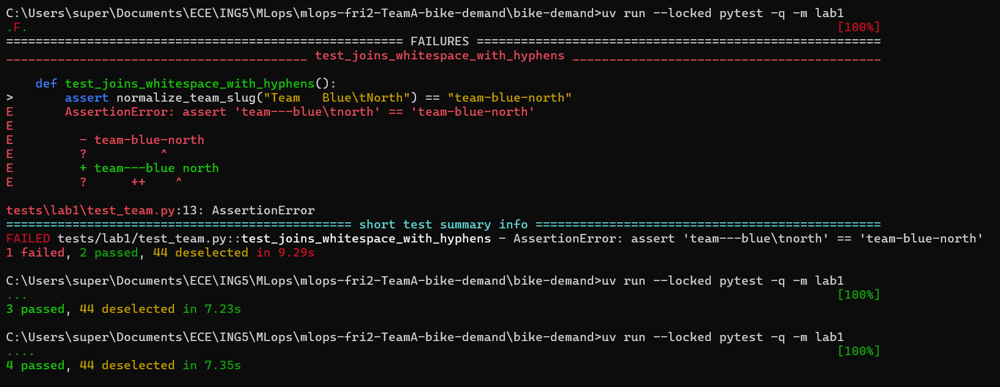
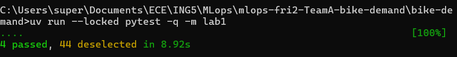
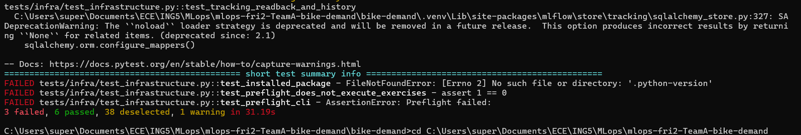
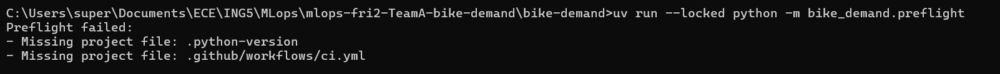
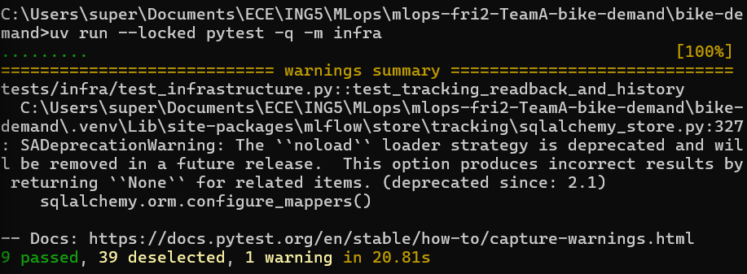
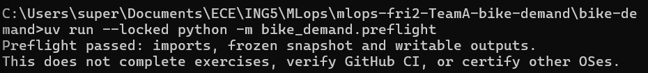
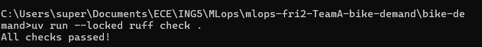
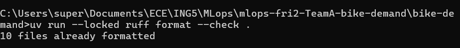
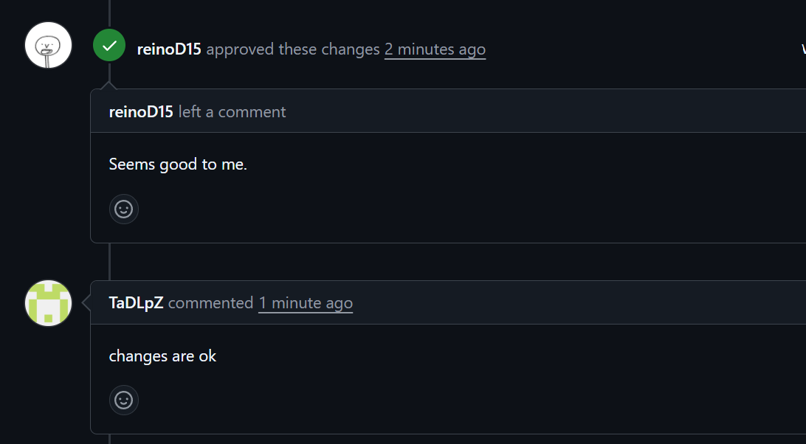
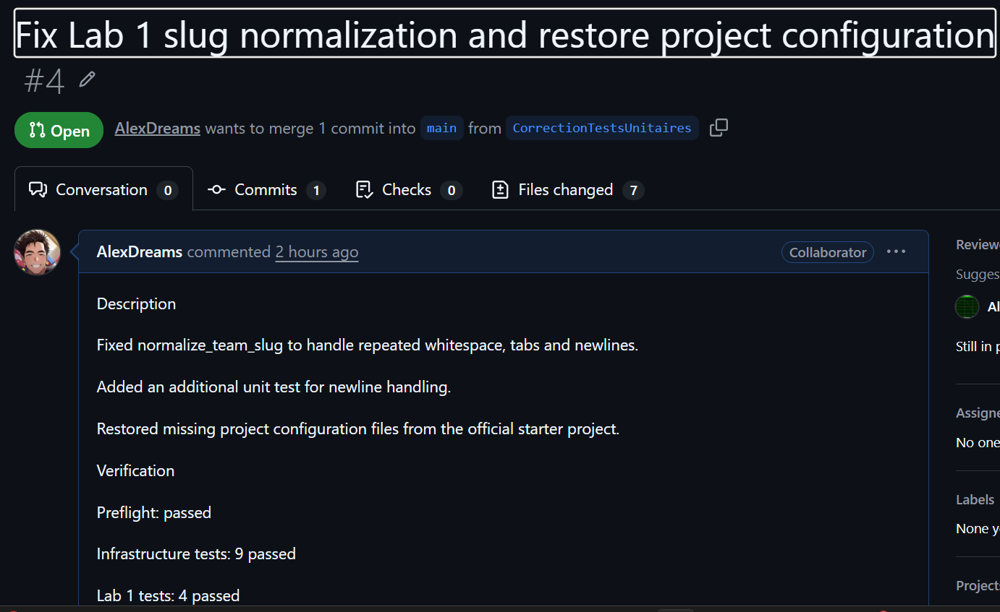

# Lab 1: Team workflow and check record

Record observed facts or blocked/not-run with reasons. This team worksheet is not an individual's graded Week 1 report.

## Team and setup

- **Team/repository:** Team A Bike Demand — https://github.com/reinoD15/mlops-fri2-TeamA-bike-demand
- **Week/date:** Week 1, 10 October 2026 (report assembled; individual test dates not separately verified).
- **Members and temporary roles:** Alexandre: Lab 1 code fix, extra test, local checks, PR author and evidence; Thaddée: working agreement and primary review; Nicolas: repository creation, project README and secondary review; Alban: architecture. Exact Lab 2 roles pending.
- **Repository/authentication access checks:** Alexandre pushed a branch and opened PR #4; team reviews and documentation contributions were observed. Individual access checks for every member not recorded.
- **Mac version/architecture, Python and uv versions:** Alexandre ran on Windows, Python 3.12 (project version file). Mac information not applicable to his machine. Exact OS/architecture and uv version per member not recorded.
- **Environment/preflight command and actual outcome:** From `bike-demand/`, `uv run --locked python -m bike_demand.preflight`: initially failed due to missing `.python-version` and `.github/workflows/ci.yml`; after restoring starter configuration: `Preflight passed: imports, frozen snapshot and writable outputs.`
- **Working agreement and backlog links:** [`WORKING-AGREEMENT.md`](../WORKING-AGREEMENT.md), [`BACKLOG.md`](../BACKLOG.md), [`CONTRIBUTING.md`](../CONTRIBUTING.md) (contribution guide pushed; PR merge status to verify).
- **Ignored outputs and secret-protection checks:** Starter `.gitignore` restored. No credentials appear in the attached evidence. A dedicated `git status --ignored`/secret audit was not documented.

## Reviewed change and checks

- **Branch, pull request and checked commit:** `CorrectionTestsUnitaires`, [PR #4](https://github.com/reinoD15/mlops-fri2-TeamA-bike-demand/pull/4), commit `1ed9245` (local checks shown in screenshots; screenshot does not display commit hash). PR reported merged by team.
- **Substantive change and responsible contributor:** Alexandre changed `normalize_team_slug` to `"-".join(team_name.lower().split())`, normalizing spaces, repeated whitespace, tabs and newlines.
- **Additional test and why it is useful:** Alexandre added a newline-whitespace case in `tests/lab1/test_team.py`, preventing regression on input containing line breaks.
- **Reviewer observation, response and merge status:** GitHub screenshots show reviewer `reinoD15` approving with “Seems good to me.” and `TaDLpZ` commenting “changes are ok”. No requested change or corresponding author revision is visible in these screenshots; merge reported by team, but the attached PR screenshot predates merge.
- **Local lint/format/test commands and actual results:**
  - `uv run --locked pytest -q -m lab1`: before fix **1 failed, 2 passed, 44 deselected**; after fix and additional test **4 passed, 44 deselected**.
  - `uv run --locked pytest -q -m infra`: before configuration repair **3 failed, 6 passed, 38 deselected, 1 warning**; after repair **9 passed, 39 deselected, 1 warning**.
  - `uv run --locked ruff check .`: **All checks passed!**
  - `uv run --locked ruff format --check .`: **10 files already formatted**.
  - `uv run --locked python -m bike_demand.preflight`: **Preflight passed** after repair.
- **Intentional exercise failure versus infrastructure failures:** Intended Lab 1 bug: incorrect slug normalization (`team---blue\tnorth` instead of `team-blue-north`). Separate infrastructure failure: missing `.python-version` and workflow file. The remaining SQLAlchemy `SAWarning` is a deprecation warning, not a test failure.
- **CI check names, actual statuses and checked revision:** GitHub Actions workflow `Week 1 checks`, job `infrastructure`: user observed **“All checks have passed”** on the `fix-github-actions` pull request after fixing the workflow location and restoring the starter-required nested workflow file. The exact successful check SHA, PR URL, and merge status must be copied from GitHub. The earlier PR #4 screenshot showed `Checks 0` and does not itself establish CI success.
- **Starter/reference/collaborator/other assistance:** Official course starter and teammates' code/reviews/docs; ChatGPT-assisted troubleshooting and report drafting. Final results were validated through local commands and screenshots.

## Lab 2 handover

- **Next driver/reviewer:** **To confirm.** Lab 2 driver must differ from Lab 1 driver Alexandre; reviewer to be assigned.
- **Readiness and remaining blockers:** Lab 1 local code quality, tests and preflight pass. GitHub Actions checks passed on the CI-fix PR as reported by Alexandre. Confirm CI-fix PR merge, documentation PR merges, and report PR review/merge. Lab 2 can begin in parallel on a separate branch.
- **One bounded next action and owner:** Alexandre: save a screenshot of the successful CI checks (including checked commit), add its SHA/PR link to this report, and submit the report PR for peer review.
- **Own-contribution links retained for each student's Week 1 report:** Alexandre: [PR #4](https://github.com/reinoD15/mlops-fri2-TeamA-bike-demand/pull/4), commit `1ed9245`; others: add links to their merged documentation/architecture PRs. Each student maintains a separate private graded Week 1 report.

## Screenshots

Initial intended failing `lab1` test (1 failed, 2 passed), followed by passing runs (3 passed, then 4 passed). Local terminal evidence for PR #4.

Final `lab1` run: 4 passed, 44 deselected.

Initial infrastructure failures: 3 failed, 6 passed, due to missing starter configuration.

Preflight initially missing `.python-version` and `.github/workflows/ci.yml`.

Infrastructure rerun: 9 passed, 39 deselected, 1 deprecation warning.

Preflight passed after restoring configuration.

Ruff lint: all checks passed.

Ruff format check: 10 files already formatted.

PR #4 reviewer approval and second comment; reviewer handles visible in screenshot.

PR #4 description and `Checks 0` (not proof of passing CI; screenshot shows PR still open).

**Additional CI evidence to add:** Screenshot of `Week 1 checks / infrastructure` showing “All checks have passed” on the `fix-github-actions` PR. Record the checked SHA and PR URL in the CI section above.
