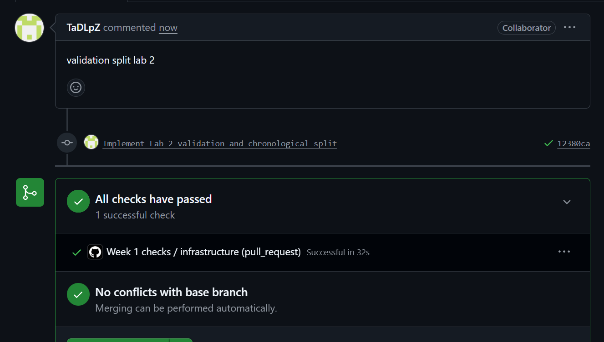
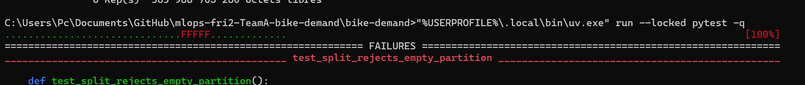
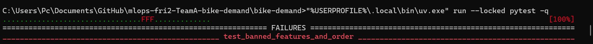
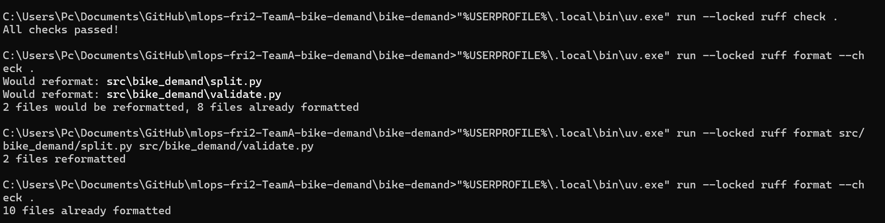
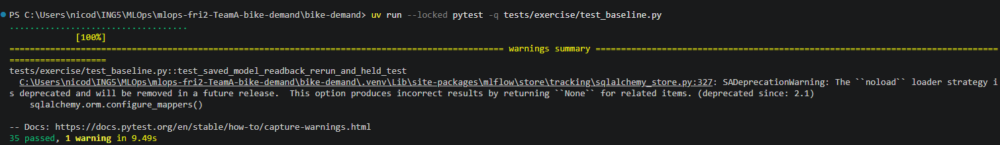
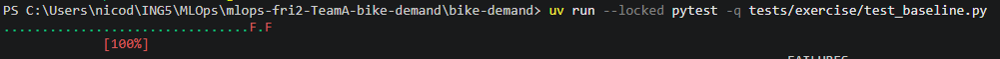
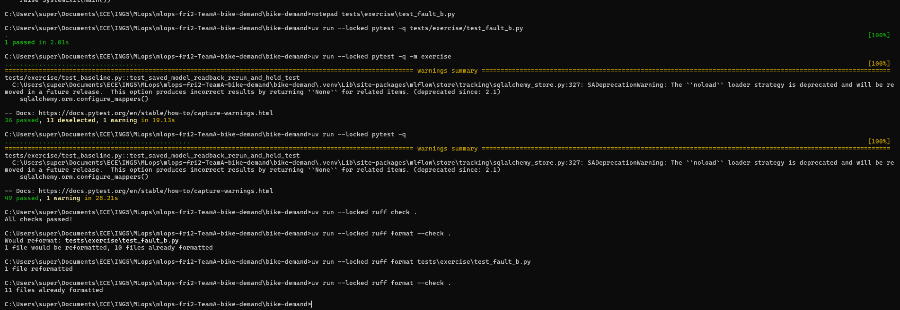

# Week 1, Labs 1–2: team evidence

## Team and roles

**Team:** Team A – Bike Demand  
**Repository:** https://github.com/reinoD15/mlops-fri2-TeamA-bike-demand  
**Week:** Week 1, 10 October 2026

**Team members:** Alexandre, Thaddée, Nicolas and Alban.

For Lab 1, Alexandre worked on the code correction, an additional unit test, local verification and evidence collection. Thaddée was the main reviewer. Nicolas worked on repository setup, the README and secondary verification. Alban worked on the project architecture and technical organization.

For Lab 2, Thaddée implemented data validation and chronological splitting. Nicolas implemented baseline training and MLflow tracking. Alexandre added the independent Fault B test and performed final local checks.

We used separate Git branches and pull requests to organize the work. Our working agreement requires another team member to review changes before merging.

## Repository and pull requests

**Main repository:** https://github.com/reinoD15/mlops-fri2-TeamA-bike-demand

**Lab 1**

- PR #4 – Code correction and additional unit test: https://github.com/reinoD15/mlops-fri2-TeamA-bike-demand/pull/4
- PR #6 – GitHub Actions and infrastructure correction: https://github.com/reinoD15/mlops-fri2-TeamA-bike-demand/pull/6
- PR #8 – Lab 1 report and screenshots: https://github.com/reinoD15/mlops-fri2-TeamA-bike-demand/pull/8

**Lab 2**

- PR #9 – Data validation and chronological split: https://github.com/reinoD15/mlops-fri2-TeamA-bike-demand/pull/9
- PR #10 – Baseline training and MLflow tracking: https://github.com/reinoD15/mlops-fri2-TeamA-bike-demand/pull/10
- PR #11 – Independent Fault B test: https://github.com/reinoD15/mlops-fri2-TeamA-bike-demand/pull/11

PRs #6, #8, #9 and #10 were merged into `main`, as shown by the Git history.

PR #11 was created from the `lab2-fault-b` branch with commit `f2bb21b`. GitHub reported one successful CI check, completed in 22 seconds, and no merge conflicts.

Nicolas subsequently merged PR #11 into `main`. A formal review comment and approval have not yet been confirmed.

## Setup, preflight and quality checks (commands and actual results)

We used Python 3.12, `uv`, `pytest`, Ruff and GitHub Actions.

The project commands were run from the `bike-demand/` directory.

**Lab 1**

The first Lab 1 test run exposed a problem in `normalize_team_slug`. The function did not correctly normalize repeated whitespace, including tabs and newlines.

Alexandre changed the implementation to:

`"-".join(team_name.lower().split())`

He also added a test for a team name containing a newline, to prevent the problem from returning.

The Lab 1 tests initially reported 1 failure and 2 passes. After the correction and additional test, the result was 4 passed.

We also encountered an infrastructure problem. The preflight check failed because `.python-version` and `.github/workflows/ci.yml` were missing from the expected locations.

After restoring the required starter configuration, the preflight command passed:

`uv run --locked python -m bike_demand.preflight`

Result:

`Preflight passed: imports, frozen snapshot and writable outputs.`

The infrastructure tests improved from 3 failed and 6 passed to 9 passed, with one warning.

The GitHub Actions workflow was also corrected. The team observed a successful `Week 1 checks / infrastructure` CI check on the CI-fix pull request.

**Lab 2**

The final local checks after adding Fault B were:

| Command | Actual result |
|---|---|
| `uv run --locked pytest -q tests/exercise/test_fault_b.py` | 1 passed |
| `uv run --locked pytest -q -m exercise` | 36 passed, 13 deselected, 1 warning |
| `uv run --locked pytest -q` | 49 passed, 1 warning |
| `uv run --locked ruff check .` | All checks passed |
| `uv run --locked ruff format --check .` | 11 files already formatted |

The warning came from a deprecated SQLAlchemy loading strategy used by MLflow. It did not cause any test failure.

Earlier checks found test failures and formatting problems in the Lab 2 implementation. The team corrected the code and reformatted `validate.py` and `split.py`. Later checks passed.

The final Fault B pull request also passed GitHub Actions before being merged.

## Data identity, validator checks and added test

**Dataset:** `data/raw/hour.csv`

**Number of rows:** 17,379

**SHA-256:**

`e03de4ee4ef4dc376ac6e04bf829673c6269e8eba5c60fa121640fa2f829504f`

The original dataset was kept unchanged.

The validator checks:

- Required columns and non-missing values.
- Valid categorical values, such as hours from 0 to 23 and months from 1 to 12.
- Finite normalized weather values between 0 and 1.
- Non-negative integer rental counts.
- Valid dates in the expected 2011–2012 period.
- Unique positive integer row identifiers.

The validation command was:

`uv run --locked python -m bike_demand.validate --data data/raw/hour.csv`

Result:

`Validated 17379 rows; input bytes unchanged.`

**Additional test**

We created `tests/exercise/test_fault_b.py`.

The test reads five valid rows from the 2011 training period. First, it saves and validates an unchanged control copy. Then it changes one `cnt` value to `-1` and checks that the validator raises the expected error.

All columns are kept, and only one contract rule is broken.

The test passed. The original CSV was not modified.

## Partition counts, boundaries and held test rows

The data is sorted chronologically using `dteday`, `hr` and `instant`.

The split is:

| Partition | Period | Rows |
|---|---|---:|
| Training | 2011-01-01 to 2011-12-31 | 8,645 |
| Validation | 2012-01-01 to 2012-06-30 | 4,358 |
| Held test | 2012-07-01 to 2012-12-31 | 4,376 |
| **Total** | **2011–2012** | **17,379** |

The partitions are chronological, complete and disjoint.

We used the 2011 data for training and the first half of 2012 for validation. The second half of 2012 was reserved as the held-test partition.

This avoids using future observations to train the model.

We also excluded `cnt`, `casual`, `registered`, `instant` and `dteday` from the predictors. The rental counts contain target information, while the identifiers and date are not part of the required feature contract.

One important correction concerned an overly strict validation rule requiring `cnt` to equal `casual + registered`. This check was removed because it was not part of the specified contract and interfered with a test that deliberately changed held-test labels to verify independence.

No held-test performance metric was used to select the model.

## Comparator and RF: run IDs, validation MAEs, metadata/readback

**Training command:**

`uv run --locked python -m bike_demand.train --config configs/baseline.yaml`

**Training commit:**

`f1f8b433186ccb44fe87d52f2163982ed5ad45b0`

**Configuration:** `configs/baseline.yaml`

**Ordered predictors:**

`season`, `yr`, `mnth`, `hr`, `holiday`, `weekday`, `workingday`, `weathersit`, `temp`, `atemp`, `hum`, `windspeed`

The baseline compares a simple training-mean predictor with a Random Forest model.

**Training target mean:** 143.79444765760556

**Random Forest configuration:**

- `n_estimators = 50`
- `max_depth = 10`
- `random_state = 42`
- `n_jobs = 1`

**Validation results**

| Model | Validation MAE |
|---|---:|
| Training-mean comparator | 154.23179306864967 |
| Random Forest | 86.84685685591091 |

The Random Forest reduced validation MAE by approximately 43.7% compared with the training-mean comparator.

**MLflow runs**

- Training-mean comparator: `287ceebf08a94206892d4b116f1dbc3f`
- Random Forest: `7916ccfd2af54193b6e398570f69d76a`

The training process saved the model and metadata. We checked that the saved model could be loaded again.

After reloading, the validation MAE was identical. The maximum absolute difference between the original predictions and the reloaded model predictions was zero.

The metadata and dataset identity were also checked.

## Optional stretch, after the core: unchanged-config repeat (new run IDs, history, differences)

Not attempted as a separate documented stretch experiment.

The core training and saved-model readback checks were completed.

## Fault diagnosis and your own Fault B

**Choice:** We changed one `cnt` value to `-1` in a small copy of five valid training rows.

**Reason:** Negative rental counts are invalid. Rejecting them prevents incorrect target values from entering the training pipeline.

**Result:** The valid control passed. The faulty copy was rejected with `cnt: counts must be non-negative integers`. The test passed, and the original CSV was unchanged. This test covers one negative-count example, not every possible invalid input.

## Review observation and author's response

**Lab 1**

PR #4 received review feedback from other team members. The available screenshots show approval and a positive comment. No requested revision is visible in those screenshots.

The team also diagnosed and corrected the infrastructure problems found during local checks.

**Lab 2**

The team observed initial test failures and Ruff formatting problems while integrating validation and splitting.

The formatting problems were corrected using Ruff. The implementation was also adjusted to satisfy the specified validation and splitting contracts. The final test suite passed.

PR #9 and PR #10 were merged into `main`. The exact reviewer comments and author responses for these PRs have not yet been copied into this report.

**Fault B review and merge**

PR #11 passed GitHub CI and was merged into `main` by Nicolas.

A formal review comment and an author's response have not yet been confirmed. We do not claim a review approval without evidence.

## Contribution and assistance/recovery acknowledgement

**Alexandre**

- Corrected the Lab 1 slug normalization bug.
- Added a Lab 1 regression test for newline whitespace.
- Ran local checks and collected evidence.
- Helped diagnose and recover from the infrastructure failures.
- Added the Lab 2 Fault B test.
- Ran the final Lab 2 tests and Ruff checks.
- Prepared the team evidence report.

**Thaddée**

- Worked on the team working agreement and Lab 1 review.
- Implemented Lab 2 data validation and chronological splitting.

**Nicolas**

- Created the repository and worked on the README.
- Provided secondary verification for Lab 1.
- Implemented Lab 2 baseline training and MLflow tracking.
- Merged the Fault B pull request after successful CI.

**Alban**

- Worked on project architecture and technical organization.

The team used the official course starter repository, documentation and collaboration between members.

ChatGPT was used to assist with troubleshooting, test preparation and report drafting. Technical claims in this report are based on actual command results, code, Git history and screenshots.

## Blockers and next action

The Lab 2 technical work is complete. PR #11 has been merged into `main` by Nicolas, and the local tests and quality checks passed.

**Remaining actions:**

1. Confirm whether Nicolas left a formal review comment on PR #11.
2. Check the screenshot links and captions in `reports/images/`.
3. Verify any missing reviewer details for PRs #9 and #10.
4. Finalize the team report and create the required Week 1 checkpoint tag with a short checks/blockers note.

No unresolved technical failure is currently known.

## Screenshots

The Lab 1 evidence is documented in `reports/lab-01.md`, with screenshots of the initial failures, corrections, passing tests, preflight recovery and PR review.

PR #9: validation and chronological split, commit `12380ca`. GitHub CI passed.

Initial test failures during Lab 2 implementation. These are intermediate results, not the final test status.

Additional failing checks used to diagnose implementation problems before the corrections.

Ruff formatting corrections for the validation and splitting code.

Passing baseline exercise tests after the training and tracking implementation.

Intermediate failure during Lab 2 verification, before the final successful checks.

Final local verification after Fault B, commit `f2bb21b`: 36 exercise tests passed, 49 total tests passed, and Ruff checks passed.